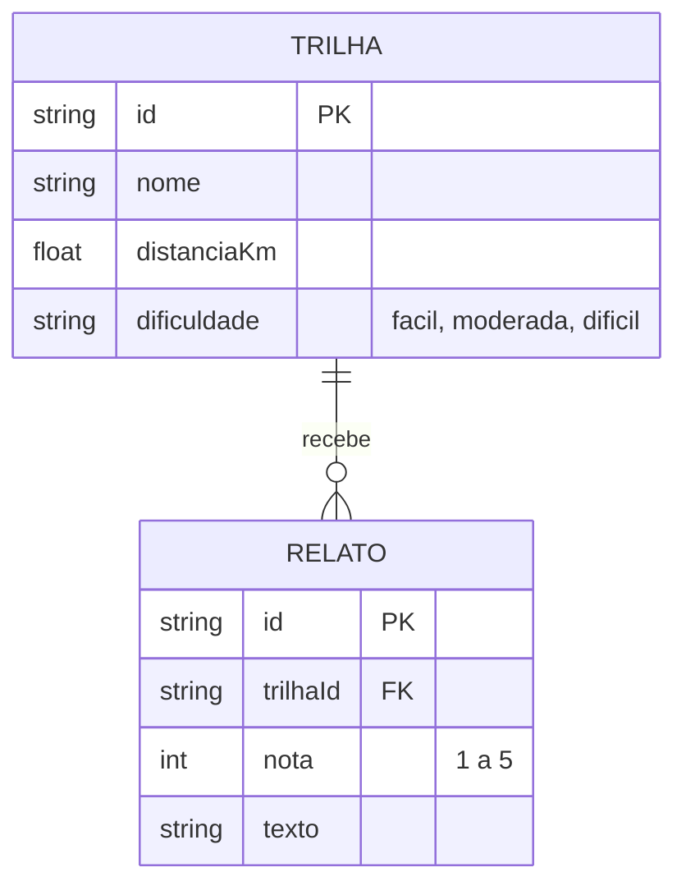

```mermaid
erDiagram
  TRILHA ||--o{ RELATO : "recebe"
  TRILHA {
    string id PK
    string nome
    float distanciaKm
    string dificuldade "facil, moderada, dificil"
  }
  RELATO {
    string id PK
    string trilhaId FK
    int nota "1 a 5"
    string texto
  }
```
